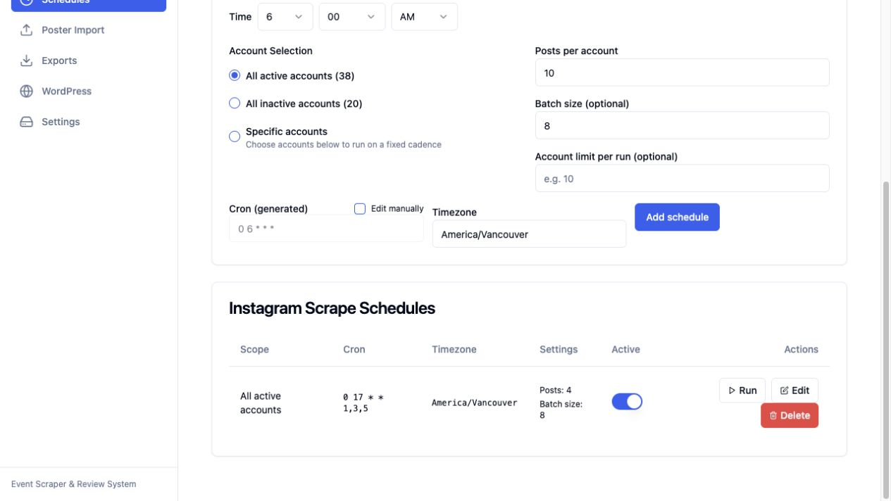

# Instagram pipeline repair — September 28, 2026

The migrated Instagram schedule was disabled. Its last stored run was May 11,
2026. There are 58 configured accounts, 38 active; all use manual classification.
The website-source sweep did not restart this separate pipeline.

## Changes

- UI, ingestion and explicit review use the same global AI provider, credentials
  and model, with legacy Instagram settings as fallback. The live selection is
  OpenRouter / `moonshotai/kimi-k2.5`. Unsupported providers or missing selected
  credentials fail instead of silently switching to Gemini.
- Schedule configuration accepts migrated JSON strings and validates the parsed
  object. The existing four-post limit and batch size eight are retained.
- Manual accounts store posts and durable images for review. They do not
  automatically classify posts or create extracted event records, even when
  global AI flags are enabled. Explicit review remains available.
- Image, classification, extraction and persistence failures produce visible run
  counters and warnings. Partial work is recorded as partial; entirely failed
  imports fail their queue jobs. Quota exhaustion fails without paid retries.
- Scheduled accounts receive stable child run IDs, including across retries.
  Batch runs wait for every expected account before reporting completion.
- WordPress schedule previews and exports share target selection. Legacy account
  IDs are resolved; unknown targets fail without falling back to all sources.
  Instagram base posts cannot be exported, including posts with an extraction
  preview. Exports require a distinct approved extracted event with a valid date.
- The review API supplies `null` for pending classification, matching the UI
  contract. Previously missing values could display as “Marked as Not Event.”
  The Instagram help panel now describes the configured provider and manual mode.

## Live pilot

Account: `@unbcoutdoorsclub`, limit two, batch size eight.
Run: `kn777y6dz67035zxnzwkzkr4398f8nr7`.

- Two posts fetched and saved; both images persisted in Convex storage and returned
  HTTP 200 as `image/jpeg`.
- Zero warnings, zero automatic classifications, zero extracted event records.
  Both posts remained pending review.
- Explicit extraction preview (`createEvents: false`) used OpenRouter and extracted
  “Learn to Camp,” September 29, 2026, 18:00–19:30 America/Vancouver.
  It stored a candidate extraction without approving or publishing the post.
- Review totals changed from 972 to 974; approved/rejected counts stayed at
  428/544, with two pending. Upcoming scheduled export preview for this account
  returned zero eligible events, including after the AI preview.

- A repeat pilot on the final worker (`kn702fnkvj5qz8ye6hentsvd8x8f90fe`)
  skipped both known posts, added no duplicates, and persisted its success/counters
  in the queue job result.

## Validation and deployment

43 focused regression tests passed across ingestion, provider/configuration,
review serialization, schedules, queue failure handling and run reporting.
Convex typecheck and both production builds passed. Full strict worker typecheck
still has pre-existing failures outside the changed production files; the worker
production build uses the repository's existing `noCheck` build configuration.

Convex functions were deployed to the self-hosted backend. Admin and worker were
rolled out using `Proxmox-Playbook/scripts/eventscrape-deploy.sh`:
`dev-1790621749-fa6dcee-dirty`. The tag reflects an rsync build of this change on
base `fa6dcee`; it includes uncommitted implementation files. Both deployments
completed successfully and both EventScrape URLs returned HTTP 200.

## Resumed schedule

Existing schedule `ks7fd3pdw6jfpa8f78fyv9ggwh86k3n3` is enabled.
It runs Monday, Wednesday and Friday at 17:00 America/Vancouver, across all 38
active accounts, with `postLimit: 4` and `batchSize: 8`. Its migrated JSON string
was normalized to an object. All 58 accounts retain manual classification.
Next due time at verification: September 28, 2026, 17:00 PDT (September 29,
00:00 UTC). This is the next scheduled dispatch, not a completed full-account run.

## Operation

Review new posts at `/app/review`, verify AI dates and details, and explicitly
approve/create event records before exporting them. The four-post setting fetches
recent posts; it is not a historical backfill of everything since May.
