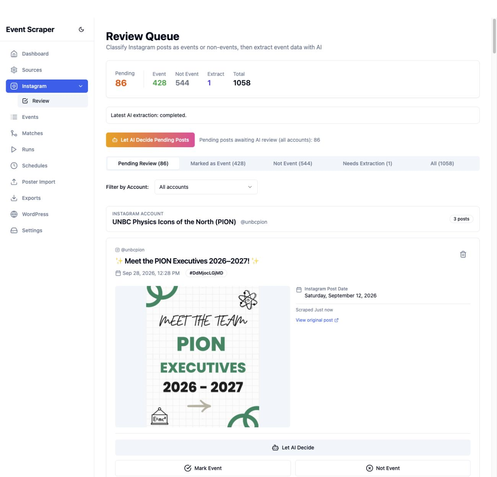

# Review queue responsiveness and full Instagram pull — September 28, 2026

## Why it felt slow

The review page inherited a five-minute React Query freshness window and disabled
refresh-on-focus. It did not poll for incoming posts or completed background AI
jobs. The worker could finish while the browser kept showing the old queue.

AI endpoints now return a queued job, but the page still treated their responses
as completed extraction/classification results. This could display an undefined
created-event count or access a missing classification object. Bulk actions also
expected obsolete success/failure counts.

The backend loaded the entire `eventsRaw` catalogue, including unrelated website
events, before filtering Instagram posts. Queue and statistics requests each did
this work. Known-post checks during ingestion also traversed the whole table.

## Changes

- Restrict review reads to Instagram source indexes; use an account index when an
  account is selected. Known-post checks use the same account index.
- Return a small indexed job-progress response without raw job payloads or keys.
  It includes active AI jobs, remaining ingestion jobs and the latest 20 AI jobs
  updated within the last 24 hours, excluding old failures from current feedback.
- Refresh progress every three seconds while work runs (ten seconds when idle),
  and queue/statistics every five seconds during work (15 seconds when idle).
  Refresh on window focus and invalidate results when AI progress changes.
- Distinguish queued work from completed work in single and bulk action feedback.
  The Events table's extraction action also reports queuing truthfully.
- Show background processing and failures on the review page. Block actions only
  on posts currently being processed, leaving other posts available for review.
- Display an error if loading the queue fails instead of incorrectly reporting
  that everything has been reviewed.

## Verification

Seven targeted configuration/review tests passed, including index-only reads,
source/account isolation, pagination, pending classification, progress states and
excluding old failures. The broader backend regression selection passed 35 tests.
Convex typecheck and production admin/worker builds passed.

Live spot measurements: the initial pre-change queue request took 1,968 ms;
the first measured request after the indexed change took 213 ms. Cached requests
were approximately 7–12 ms. These are individual observations under changing
load and catalogue size, not a controlled benchmark.

In the browser, incoming posts appeared without reloading. A preview-only AI
extraction (`createEvents: false`, job `k971an7dmqdapc6xk7nrkjxta18f96ws`)
visibly changed from running to completed without reloading; it did not approve
or publish a post.

The Convex backend was deployed in place. Only the admin deployment was rolled
for frontend changes so the active Instagram worker could finish its queue.
Admin image: `dev-1790623131-e2c7263-dirty`; worker image remains
`dev-1790621749-fa6dcee-dirty`.

## Full pull

Batch run: `kn71btyxqp60pcfn2w0rfsr40h8f8558`.
All 38 active accounts were queued with four recent posts/account and batch size
eight. The 20 inactive accounts remain inactive. Manual review remains enabled;
this pull creates review posts and stores images, not automatically published
calendar events. Previously stored posts are skipped.

Two image warnings were diagnosed: `@unbcnursingclub` post `DdSNkFigT7P`
returned host `instagram.fcps4-2.fna.fbcdn.net`, and `@nbcgss` post
`Dd1tbcQz4sf` returned `instagram.fosu2-2.fna.fbcdn.net`. Both failed DNS lookup
on a separate retrieval attempt. The posts remain saved for review; those two
images are unavailable. Historical run warnings are retained accurately.

Final outcome: all 38 accounts completed (36 success, two partial; no fatal
failures). Workers performed 86 post saves and 84 image uploads; shared posts
were deduplicated, leaving **84 new unique review posts, 82 with stored images**.
The two image failures described above account for the difference. The review
queue now has 86 pending posts, including the two earlier pilot posts, and 1,058
records overall. Existing approved/rejected counts remain 428/544. No event
records were automatically created or published, and all 58 configured accounts
retain manual classification.

